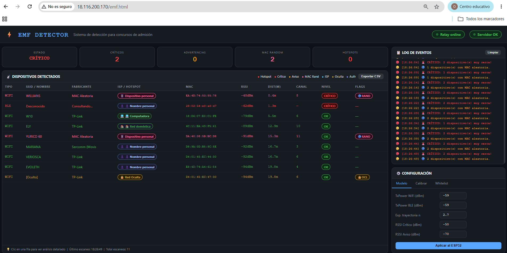

# Detector Electromagnético ESP32 + EC2 Cloud

**Alumno:** Oscar David Barrientos Huillca - 225419

Sistema IoT de detección de dispositivos electrónicos no autorizados mediante escaneo WiFi y BLE. El ESP32 escanea redes WiFi y dispositivos Bluetooth Low Energy, calcula distancias estimadas usando el modelo Log-Distance Path Loss, clasifica niveles de amenaza (INFO/WARNING/CRITICAL) y envía los resultados por WebSocket a un **servidor EC2** que sirve un **dashboard web** en tiempo real, diseñado para entornos de admisión y supervisión de exámenes.

---

## Capturas



---

## Estructura del Proyecto

```
detector-electromagnetico/
├── platformIO/                     # Firmware ESP32 (PlatformIO)
│   ├── src/main.cpp                # Escáner WiFi + BLE con WebSocket
│   ├── platformio.ini              # Configuración ESP32
│   ├── .gitignore
│   ├── .vscode/                    # Config IDE auto-generada
│   └── logs_emf/                   # Sesiones de escaneo (CSV + logs)
│
├── aws/                            # Servidor Cloud EC2
│   ├── app.py                      # WebSocket server (FastAPI + uvicorn)
│   └── emf.html                    # Dashboard web (JS + WebSocket)
│
├── README.md
├── image.png
└── oui.txt                         # Lista OUI de referencia
```

---

## Arquitectura del Sistema

```
ESP32 (WiFi + BLE Scanner)
       │
       │ WebSocket JSON @ 8765
       │ Protocolo: SCAN_REPORT, HEARTBEAT, etc.
       │ Comandos: SET_MODEL, SET_THRESHOLDS, CALIBRATE, etc.
       ▼
┌───────────────────────────────────┐
│  EC2 (FastAPI + WebSocket Server)  │
│  app.py — Puerto 8765             │
│                                   │
│  • Recibe datos del ESP32         │
│  • Broadcast a navegadores        │
│  • Reenvía comandos al ESP32      │
│  • Logging persistente            │
└───────────┬───────────────────────┘
            │
            │ WebSocket @ /ws
            ▼
┌───────────────────────────────────┐
│  Dashboard Web (emf.html)         │
│  • Tabla de dispositivos          │
│  • Alertas visuales               │
│  • Identificación OUI             │
│  • Detección ISP / Hotspot        │
│  • MAC aleatoria                  │
│  • Señal RF (barra visual)        │
│  • Modal de detalle por clic      │
│  • Exportación CSV                │
│  • Calibración en vivo            │
└───────────────────────────────────┘
```

| Capa | Tecnología |
|---|---|
| Hardware | ESP32 WROOM-32 DevKit |
| Firmware | C++ con Arduino Framework |
| Escaneo WiFi | Modo station + promiscuo (canales 1-13) |
| Escaneo BLE | NimBLE-Arduino (escaneo pasivo) |
| Modelo de distancia | Log-Distance Path Loss |
| Servidor cloud | Python + FastAPI + uvicorn |
| Dashboard web | HTML + CSS + JavaScript vanilla |
| Comunicación ESP32→Server | WebSocket (JSON) |
| Comunicación Server→Browser | WebSocket (JSON) |
| OUI Lookup | API macvendors.com + caché local |

---

## Firmware ESP32

El firmware implementa un escáner dual WiFi + BLE que se conecta directamente al EC2 por WebSocket:

| Componente | Descripción |
|---|---|
| WiFi Scan | Escaneo periódico de redes (canales 1-13), captura SSID, MAC, RSSI |
| BLE Scan | Escaneo pasivo con NimBLE |
| Distancia estimada | Modelo Log-Distance Path Loss: `d = 10^((TxPower - RSSI) / (10 * n))` |
| Clasificación | CRITICAL, WARNING, INFO según RSSI/distancia |
| Whitelist | Hasta 20 SSIDs WiFi + 20 MACs BLE |
| Heartbeat | Envío periódico de estado cada 2s |
| Comunicación | WebSocket JSON al servidor EC2 |

### Pines

| Pin ESP32 | Función |
|---|---|
| GPIO 2 | LED de alerta |
| GPIO 26 | Buzzer |

---

## Servidor Cloud (EC2)

`aws/app.py` es un servidor FastAPI con WebSockets que corre en el puerto 8765:

| Endpoint | Tipo | Descripción |
|---|---|---|
| `/esp32` | WebSocket | Conexión del ESP32 (o relay.py). Recibe SCAN_REPORT, HEARTBEAT |
| `/ws` | WebSocket | Conexión del navegador. Recibe broadcast, envía comandos |
| `/api/status` | GET | Estado del servidor (relay online, scan count, browsers) |
| `/` | GET | Sirve emf.html (si se sirve desde el mismo puerto) |

---

## Dashboard Web (emf.html)

Dashboard web auto-contenido con:

- **Tabla de dispositivos** en tiempo real con colores por nivel de amenaza
- **Leyenda**: Hotspot, Crítico, Aviso, MAC Random, ISP, Oculta, Auth
- **Fabricante**: lookup local + API macvendors.com con caché
- **Detección de ISP**: Claro, Movistar, Entel, Bitel, Tigo, WOM, etc.
- **Detección de Hotspot personal**: iPhone, Samsung, Xiaomi, Huawei, etc.
- **MAC aleatoria**: detecta MAC randomizadas (iOS 14+ / Android 10+)
- **Modal de detalle** al hacer clic: información, señal RF, análisis contextual
- **Exportación CSV** de todos los dispositivos detectados
- **Configuración**: modelo, calibración y whitelist con tabs

---

## Clasificación de Amenazas

| Nivel | RSSI | Distancia | Color | Interpretación |
|---|---|---|---|---|
| **CRITICAL** | < -50 dBm | < 2 m | Rojo | Dispositivo muy cercano |
| **WARNING** | < -70 dBm | < 5 m | Amarillo | Dispositivo cercano |
| **INFO** | ≥ -70 dBm | ≥ 5 m | Verde | Dispositivo lejano |
| **WHITELIST** | — | — | Blanco | Dispositivo autorizado |
| **HOTSPOT** | — | — | Rojo intenso | Hotspot personal — máximo riesgo |

---

## Instalación y Uso

### Firmware ESP32

```bash
# Abrir en VS Code con PlatformIO
cd platformIO

# Compilar y subir
pio run --target upload

# Monitor serial
pio device monitor --baud 115200
```

Antes de subir, configurar WiFi y IP del EC2 en `src/main.cpp`:
```cpp
#define WIFI_SSID       "tu_red"
#define WIFI_PASSWORD   "tu_password"
#define EC2_HOST        "IP_DEL_EC2"
#define EC2_PORT        8765
```

### Servidor EC2

```bash
# En la instancia EC2
pip install fastapi uvicorn websockets

# Ejecutar
python aws/app.py
```

El servidor corre en `0.0.0.0:8765`. El dashboard web (`aws/emf.html`) se puede servir con Apache, Nginx, o directamente desde FastAPI.

### Dashboard Web

Abrir `http://IP_DEL_EC2/emf.html` en el navegador. Se conecta automáticamente al WebSocket.

---

## Dependencias

### Firmware (PlatformIO)

```ini
lib_deps =
    bblanchon/ArduinoJson @ ^7.0.0
    links2004/WebSockets @ ^2.4.0
    h2zero/NimBLE-Arduino @ ^1.4.0
```

### Servidor EC2

```
fastapi >= 0.100.0
uvicorn >= 0.23.0
websockets >= 11.0
```

---

## Características

- Escaneo simultáneo WiFi + BLE desde un solo ESP32
- Comunicación directa por WebSocket al servidor EC2
- Modelo Log-Distance Path Loss configurable
- Clasificación CRITICAL / WARNING / INFO con umbrales ajustables
- Dashboard web responsive con conexión en tiempo real
- Identificación de fabricante por OUI (API + caché local)
- Detección de MAC aleatorizadas (iOS 14+ / Android 10+)
- Detección de ISP y Hotspot personal para contexto de examen
- Modal de detalle con análisis de señal y riesgo contextual
- Exportación CSV desde el navegador
- Whitelist de hasta 20 SSIDs + 20 MACs

---

## Limitaciones y Pendientes

- Dependencia de conexión WiFi para el ESP32
- Sin almacenamiento persistente en el ESP32
- Sin autenticación ni cifrado WSS (WebSocket Secure)
- Sin historial persistente en el servidor (solo JSONL por sesión)
- Sin app móvil
- Sin soporte multi-ESP32
- Sin HTTPS (pendiente configurar con certbot/nginx)
